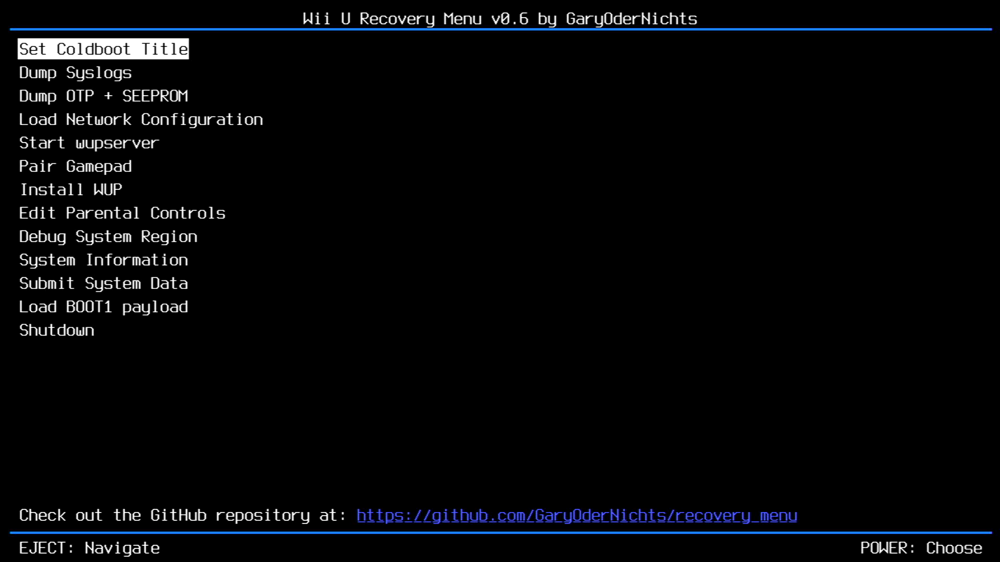

# Wii U Recovery Menu
A simple recovery menu running on the IOSU for unbricking, which can be booted using [udpih](https://github.com/GaryOderNichts/udpih). 

## Options
### Set Coldboot Title
Allows changing the current title the console boots to.  
Useful for unbricking CBHC bricks.  
Possible options are:  
- `Wii U Menu (JPN) - 00050010-10040000`
- `Wii U Menu (USA) - 00050010-10040100`
- `Wii U Menu (EUR) - 00050010-10040200`

### Dump Syslogs
Copies all system logs to a `logs` folder on the root of the SD Card.

### Dump OTP + SEEPROM
Dumps the OTP and SEEPROM to `otp.bin` and `seeprom.bin` on the root of the SD Card.

### Start wupserver
Starts wupserver which allows connecting to the console from a PC using [wupclient](https://gist.github.com/GaryOderNichts/409672b1bd5627b9dc506fe0f812ec9e).

### Load Network Configuration
Loads a network configuration from the SD, and temporarily applies it to use wupserver.  
The configurations will be loaded from a `network.cfg` file on the root of your SD.  
For using the ethernet adapter, the file should look like this:
```
type=eth
```
For using wifi:
```
type=wifi
ssid=ssidhere
key=wifikeyhere
key_type=WPA2_PSK_AES
```

### Displays DRC Pin
Displays the Gamepad Pin used for pairing the gamepad.  
The numeric values represent the following symbols: `♠ = 0, ♥ = 1, ♦ = 2, ♣ = 3`.

### Install WUP
Installs a valid signed WUP from the `install` folder on the root of your SD Card.  
Don't place the WUP into any subfolders.

## Building
```bash
# build the docker container
docker build -t recoverybuilder .

# build the menu
docker run -it --rm -v ${PWD}:/project recoverybuilder make
```

## Credits
- [@Maschell](https://github.com/Maschell) for the [network configuration types](https://github.com/devkitPro/wut/commit/159f578b34401cd4365efd7b54b536154c9dc576)
- [@dimok789](https://github.com/dimok789) for [mocha](https://github.com/dimok789/mocha)
- [@hexkyz](https://github.com/hexkyz) for [hexFW](https://github.com/hexkyz/hexFW)
- [@rw-r-r-0644](https://github.com/rw-r-r-0644) for the lolserial code
- [decaf-emu](https://github.com/decaf-emu/decaf-emu) for a lot of IOS documentation
